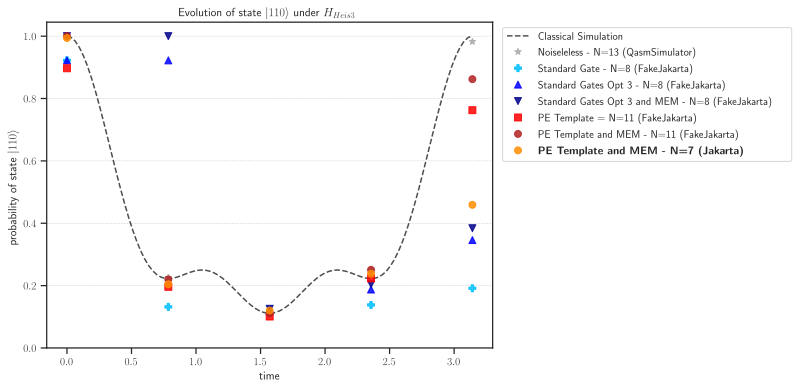

# Quantum Simulation of the XXX Heisenberg Spin Model with IBMQ Jakarta

In this project, we describe and calculate different approaches and methodologies to evolve the state $|110\rangle$ to time $t=\pi$ for the XXX Heisenberg model Hamiltonian. Our approaches use standard and pulse efficient gate approaches, with and without measurement error mitigation, to increase the state fidelity of simulations. The simulations are run using the noisy simulator `FakeJakarta()` and the final experiments are run in IBMQ's Jakarta device using the parameters of the simulations with highest fidelity. We show that __a pulse-efficient simulation obtained using the template optimization methodology of [Earnest et al. 2021](https://arxiv.org/abs/2105.01063) gives state fidelities of $\approx$ 0.8-0.85 in noisy simulators and state fidelities of $\approx$ 0.5 on Jakarta__. This will be described in detail in Sec. VI with the final Jakarta runs on subsection VI.5.

The notebook is self-contained and can be run with all simulations or only with the Jakarta executions. 

__Fig 1: State fidelity for the different simulations and Jakarta runs.__

__Fig 2: State $|110\rangle$ evolution.__

This project is publicly available at https://github.com/ufranca/IBMQ-open-science-2021.

